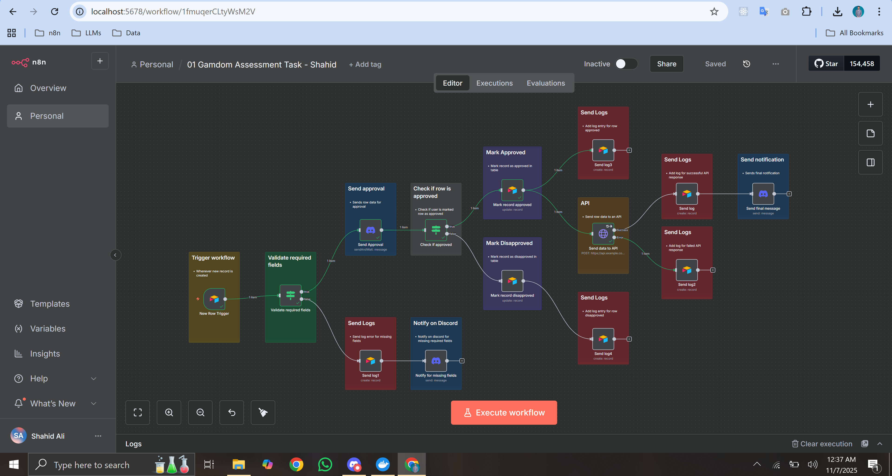

# ✅ Workflow README – n8n Automation Engineer Task

## 📌 Overview

This workflow automates the processing of newly submitted records using **n8n**.  
It includes data validation, approval handling, API submission, logging, and notifications.

Although the assignment suggests Google Sheets, this implementation uses **Airtable** as the data source, which is acceptable under the requirement (“or another data source”).

---

## Workflow Screenshot

## ✅ Workflow Summary

### 1. **Trigger — New Record in Airtable**
The workflow starts automatically whenever a new row is added to an Airtable table.

### 2. **Data Validation**
The workflow checks that the following required fields are present:

- Name  
- Email  
- Transaction ID  

If any required field is missing:
- A log entry is added to Airtable  
- A Discord notification is sent with details  
- The workflow stops for that record  

### 3. **Approval Step (Discord Interactive Message)**
If validation succeeds, an approval request is sent to a Discord channel using the `sendAndWait` feature.

- If **Approved**:
  - The record is marked as approved in Airtable
  - The data is sent to an external API via HTTP POST
  - The result (success/failure) is logged in Airtable

- If **Rejected**:
  - The record is marked as unapproved
  - The rejection is logged

### 4. **API Submission**
Approved records are sent to an external (mock) API:

- The HTTP request retries on failure  
- Successful or failed requests are logged separately  

### 5. **Notifications**
A final summary message is sent to a Discord channel confirming that the workflow completed and displaying the record details.

---

## ✅ Design Decisions

- **Airtable over Google Sheets** for easier triggering and schema consistency.
- **Discord used for approval** due to convenient interactive message support.
- **Separate logging nodes** for clarity and detailed audit trails.
- **Sticky Notes added** in the workflow to visually document each part.

---

## ✅ Assumptions

- The approver has access to the Discord server and channel used.
- Airtable tables contain the required fields.
- The API endpoint accepts test data.
- Validation only checks for non-empty values, not format (e.g., no email regex).

---

## ✅ How to Test the Workflow

1. **Create a new record in Airtable**  
   Fill all fields or intentionally miss some to test validation.
2. **Observe validation behavior**  
   Missing fields → Discord error + Airtable log entry.
3. **Approve or reject via Discord**  
   Use the interactive approval message.
4. **Approved path**  
   Record updated → API request sent → success/failure logged.
5. **Rejected path**  
   Record marked unapproved → log added.
6. **Final Summary Notification**  
   Discord receives a summary of the workflow execution.
7. **View logs**  
   Open the second Airtable table to view all execution logs.

---

## ✅ Included Files

- **workflow.json** – Full exported n8n workflow containing:
  - Trigger  
  - Validation logic  
  - Approval step  
  - API integration  
  - Logging  
  - Notifications  
  - Sticky notes for visualization  

---

